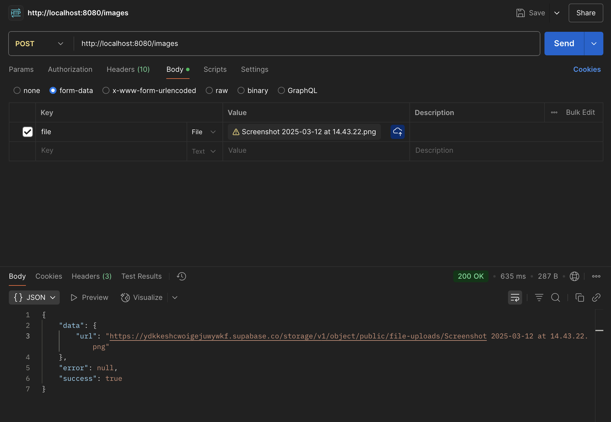
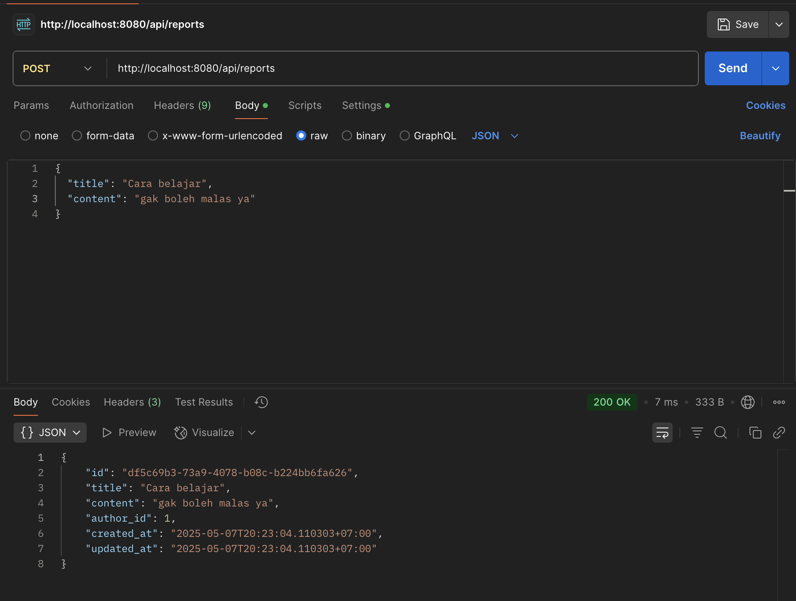
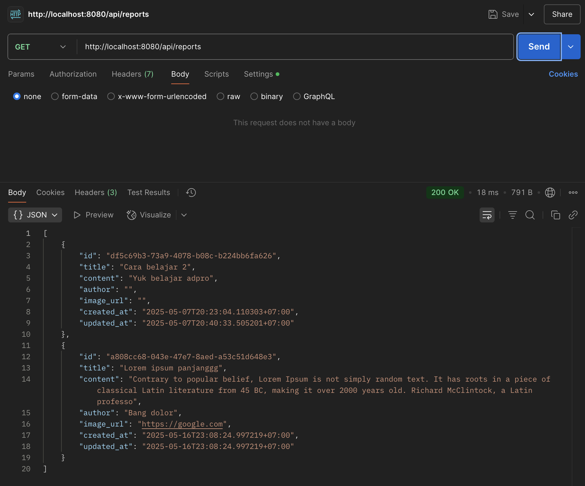
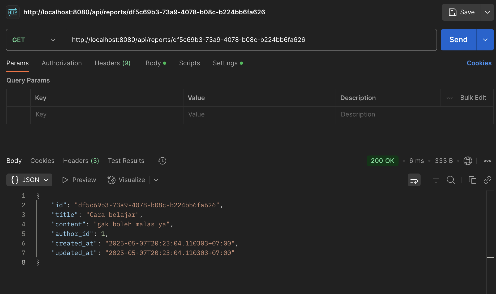
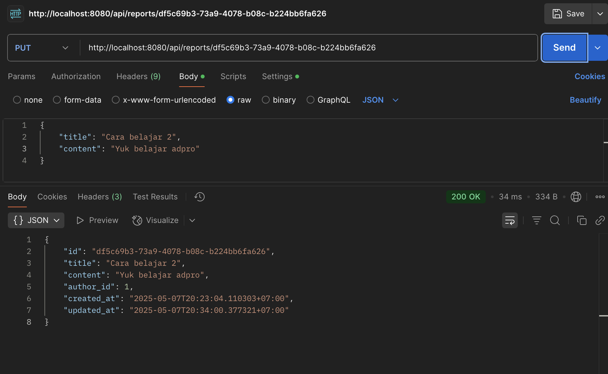
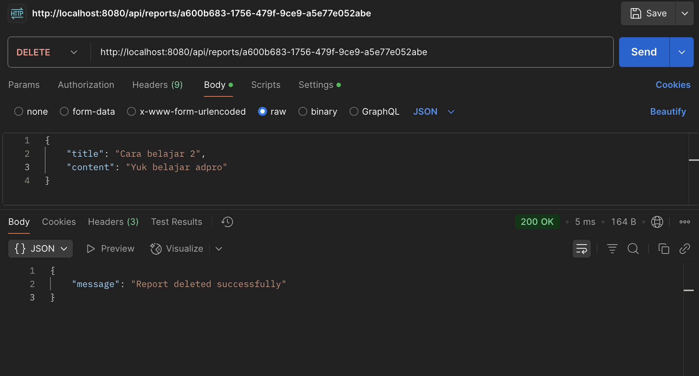

# Getting Started
1. Clone the repo and `cd` inside
2. Copy the content from `.env.sample`
3. Adjust the variable's data
4. Create a `.env` and paste the content
5. `go mod tidy`
6. `go run .`

# Endpoints

## `/images`
Supported Method: POST


## `api/reports`
Supported Method: CRUD

### POST

```bash
curl --location 'http://localhost:8080/api/reports' \
--header 'Content-Type: application/json' \
--data '{
  "title": "Cara belajar",
  "content": "gak boleh malas ya"
}'
```

### GET

```bash
curl --location --request GET 'http://localhost:8080/api/reports'
```

### GET By ID

```bash
curl --location 'http://localhost:8080/api/reports/<REPORT_ID>'
```

### Update By ID

```bash
curl --location --request PUT 'http://localhost:8080/api/reports/df5c69b3-73a9-4078-b08c-b224bb6fa626' \
--header 'Content-Type: application/json' \
--data '{
    "title": "Cara belajar 2",
    "content": "Yuk belajar adpro"
}'
```

### Delete By ID

```bash
curl --location --request DELETE 'http://localhost:8080/api/reports/<REPORT_ID>' 
```

# Note
1. For `GET /api/reports`, the content are trimmed to the first 200 characters